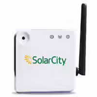

Solarcity Zigbee Sniffing
=========================

By relying on [whsniff](https://github.com/homewsn/whsniff) and a [CC2531 stick](https://smile.amazon.com/gp/product/B09JMWDJFX) to record Zigbee traffic,
the unencrypted Solarcity traffic on channel 14 can be captured and perchance deciphered.

After recording the pcap file (perhaps with the current date and time in the filename),
`parse_solarcity.sh <filename>` looks for data and outputs a TSV of timestamp + parsed data
which can be sent through `plot.sh` or `influx.sh` for visualizing or recording.

`sniff_main.sh` is a handy wrapper script for a systemd unit to run.

Tested against the SolarCity CP X2e Gateway:

